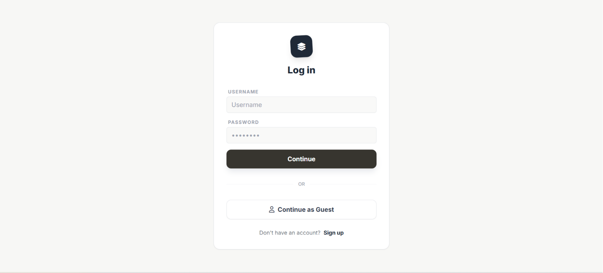
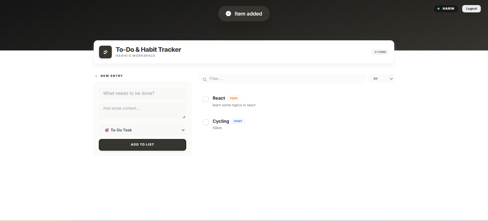
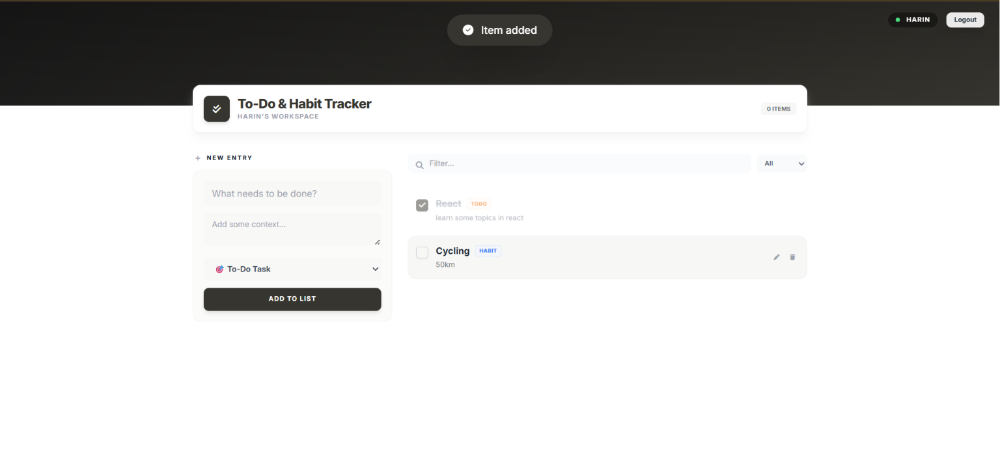

# 📝 Habit & Task Tracker

A simple and responsive web application to manage daily tasks and build productive habits.

## ✨ Features

* 🔐 User authentication (Register & Login)
* 👤 Guest mode with Local Storage support
* ✅ Add, edit, and delete tasks and habits
* ✔️ Mark items as completed or pending
* 🔍 Search and filter tasks
* 📱 Responsive design inspired by Notion
* 🛡️ Basic admin functionality

## 🛠️ Tech Stack

* HTML5
* Tailwind CSS
* JavaScript
* PHP
* MySQL

## 📸 Screenshots

## 🚀 Live Demo
http://harin.gamer.free/

## 👨‍💻 Author

**Harin**
